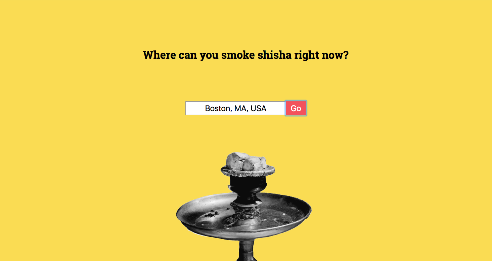
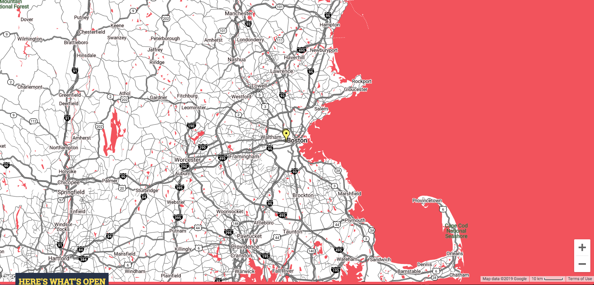

# Shisha Finder App

[Live app here](#)

## About

This is a capstone project created for the Thinkful Engineering Flex program. 

It's designed to show which hookah (shisha) bars are currently open in a given user's area. The search is set to 60km. 

___

## Screenshots

___

## Technology Used

This project used HTML,CSS, JavaScript and jQuery. 

It utilized the Google Places and Google Maps Details APIs. 

The Google Maps API does not support CORS, but the assignment called for using *fetch*, so I hacked it a bit using the Google MAPS library for some features, and then a fetch request through CORS Everywhere to pull the details (website, open hours etc.) of my places results. 

